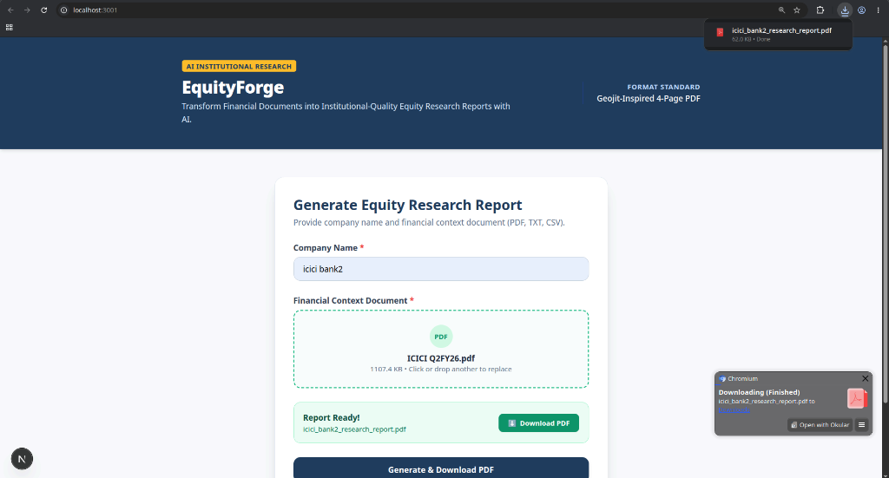

# EquityForge

**Transform Financial Documents into Institutional-Quality Equity Research Reports with AI.**

EquityForge is a production-quality financial research automation platform that transforms unstructured company financial documents into downloadable, institutional-quality equity research reports. It parses content from multiple formats (PDF, TXT, CSV), extracts structured metrics and narrative sections using LLMs (OpenAI or Google Gemini), generates programmatic financial charts, and renders a 4-page PDF report mirroring institutional equity research formats (Geojit-style).

---

## Application Preview



*Working EquityForge Next.js Web Interface showing multi-format file upload, live generation progress tracking, and automated PDF download.*

---

## System Architecture & Workflow

*For comprehensive technical design and pipeline specifications, see [docs/ARCHITECTURE.md](docs/ARCHITECTURE.md).*

```

┌──────────────────────────┐
│   Uploaded Document      │ (PDF / TXT / CSV)
└────────────┬─────────────┘
             │
             ▼
┌──────────────────────────┐
│   Document Parser        │ (pdfplumber / pandas / text decoders)
└────────────┬─────────────┘
             │ Unified Text Normalization
             ▼
┌──────────────────────────┐
│  LLM Extraction Engine   │ (OpenAI GPT-4o / Google Gemini / Heuristic Fallback)
└────────────┬─────────────┘
             │ Strict JSON Schema (Zero Hallucination)
             ▼
┌──────────────────────────┐
│  Pydantic Validation     │ (EquityResearchReport Model)
└────────────┬─────────────┘
             │
      ┌──────┴──────────────────────────┐
      ▼                                 ▼
┌──────────────────────────┐   ┌──────────────────────────┐
│  Chart Generator         │   │  Jinja2 Template Engine  │
│  (Matplotlib PNG Base64)  │   │  (Geojit HTML & CSS)     │
└────────────┬─────────────┘   └────────────┬─────────────┘
             │                              │
             └──────────────┬───────────────┘
                            ▼
               ┌──────────────────────────┐
               │  WeasyPrint PDF Renderer │
               └────────────┬─────────────┘
                            │
                            ▼
               ┌──────────────────────────┐
               │  1-Click Download PDF    │
               └──────────────────────────┘
```

### Detailed Pipeline Stages:
1. **Document Ingestion & Normalization (`document_parser.py`)**: Accepts PDF files (via `pdfplumber` for text and tables), plain text TXT files (with encoding fallback), and tabular CSV files (via `pandas`). All input content is converted into a normalized text representation.
2. **AI Metric & Narrative Extraction (`llm_extractor.py`)**: Calls OpenAI (`gpt-4o`) or Google Gemini (`gemini-2.5-flash`) with structured JSON mode and explicit prompts prohibiting data hallucination (`null` or `Not Available` for missing fields).
3. **Schema Validation (`schema.py`)**: Validates the extracted JSON into a strictly typed `EquityResearchReport` Pydantic object.
4. **Financial Chart Generation (`chart_generator.py`)**: Programmatically creates high-resolution Matplotlib visualizations (Revenue Trend, EBITDA & PAT Growth, Margin Breakdown) encoded as Base64 images.
5. **HTML/CSS Template Rendering (`pdf_generator.py`, `report.html`, `report.css`)**: Renders Jinja2 template into a 4-page A4 document matching Geojit institutional report specifications.
6. **PDF Generation & Web Download (`routes.py`, `page.tsx`)**: Converts HTML into a PDF blob using WeasyPrint and serves it to the Next.js UI for instant download.

---

## Key Features

- **Multi-Format Document Parsing**: Full support for PDF, TXT, and CSV context documents.
- **Dual LLM Provider Support**: Supports both **Google Gemini API** (`GEMINI_API_KEY`) and **OpenAI API** (`OPENAI_API_KEY`) with automatic fallback to an offline heuristic parser (`MOCK_LLM=true`).
- **Zero-Hallucination Guardrails**: Unstated metrics render cleanly as `N/A` or `Not Available` rather than fabricated values.
- **Programmatic Visualizations**: Automated Matplotlib charts for Revenue Trend, EBITDA & PAT Growth, and Margin Comparison.
- **Geojit Institutional PDF Template (4 Pages)**:
  - **Page 1:** Header, Result Update Label, Rating Badge (BUY/HOLD/SELL), Target Price & CMP, Headline, 2-Column Overview + Key Highlights, Company Data table, Shareholding %, Price Performance, Outlook & Valuation, Stock Strip.
  - **Page 2:** Key Highlights, Industry Analysis, Financial Charts row, Analyst Style Summary, Risk Analysis list.
  - **Page 3:** Consolidated Historical P&L, Balance Sheet, and Key Ratios grouped by category.
  - **Page 4:** Investment Rating Criteria table, Disclosures & Disclaimer, and EquityForge tagline.
- **Modern Next.js Frontend**: Drag-and-drop file upload, live step progress bar (`Parsing` → `Extracting` → `Charting` → `Rendering PDF`), and instant 1-click download.

---

## Tech Stack

| Layer | Technology | Description |
|-------|-----------|-------------|
| **Frontend** | Next.js 14, TypeScript, Tailwind CSS | Modern web interface with drag & drop and live progress |
| **Backend** | FastAPI, Python 3.11+ | High-performance asynchronous REST API |
| **AI Layer** | OpenAI (GPT-4o) / Google Gemini (2.5-Flash) | Structured JSON financial data extraction |
| **Document Parsing** | pdfplumber, pandas, Python text processing | PDF text/table extraction and CSV normalization |
| **Validation** | Pydantic v2 | Data schema validation and strict typing |
| **Charts** | Matplotlib (Agg backend) | Programmatic Base64 PNG visualizations |
| **Templating** | Jinja2 + HTML5 / CSS3 | Geojit report layout design |
| **PDF Engine** | WeasyPrint | Institutional A4 PDF layout engine |

---

## Project Structure

```
equityforge/
├── backend/
│   ├── app/
│   │   ├── api/
│   │   │   └── routes.py          # FastAPI upload & download endpoint
│   │   ├── core/
│   │   │   └── config.py         # Settings & environment configuration
│   │   ├── models/
│   │   │   └── schema.py       # Pydantic report schema ★
│   │   ├── services/
│   │   │   ├── document_parser.py # PDF/TXT/CSV parser engine
│   │   │   ├── llm_extractor.py   # OpenAI & Gemini extraction engine
│   │   │   ├── chart_generator.py # Matplotlib chart generator
│   │   │   ├── pdf_generator.py   # WeasyPrint HTML to PDF renderer
│   │   │   └── report_pipeline.py # End-to-end pipeline orchestrator
│   │   ├── templates/
│   │   │   └── report.html  # Geojit-style 4-page HTML template ★
│   │   └── static/
│   │       └── report.css      # Geojit report stylesheet ★
│   │   └── main.py              # FastAPI application entrypoint
│   └── scripts/
│       ├── generate_examples.py # Batch script for test PDF generation
│       └── copy_screenshot.py   # Documentation utility
├── docs/
│   └── equityforge_demo.png     # Working web app screenshot preview
├── frontend/
│   ├── src/
│   │   └── app/
│   │       └── page.tsx         # Next.js UI with Drag & Drop & progress bar
│   └── package.json
├── samples/                     # Test input documents (PDF, TXT, CSV)
│   ├── Eternal-Geojit.pdf       # Reference sample report
│   ├── ICICI Q2FY26.pdf
│   ├── JSW Energy Q2FY26.pdf
│   ├── LTTS Q2FY26.pdf
│   ├── POCL_Q2FY26.txt
│   └── Sample_Company_Q2FY26.csv
└── examples/                    # Generated output PDF reports
```

---

## Environment Variables

Copy `backend/.env.example` to `backend/.env` to configure API keys:

| Variable | Default | Description |
|----------|---------|-------------|
| `OPENAI_API_KEY` | — | OpenAI API key for LLM extraction |
| `OPENAI_MODEL` | `gpt-4o` | Model for OpenAI extraction |
| `GEMINI_API_KEY` | — | Google Gemini API key for LLM extraction |
| `GEMINI_MODEL` | `gemini-2.5-flash` | Model for Gemini extraction |
| `MOCK_LLM` | `false` | Set to `true` to skip LLM API calls and use heuristic extraction (dev/offline mode) |
| `CORS_ORIGINS` | `http://localhost:3000,...` | Allowed frontend origins for CORS |

---

## Quick Start Guide

### Prerequisites

- Python 3.11+
- Node.js 18+
- System libraries for WeasyPrint (`pango`, `cairo`, `gdk-pixbuf2`)

---

### 1. Setup & Run Backend

```bash
cd backend
python -m venv .venv
source .venv/bin/activate
pip install -r requirements.txt

# Run in offline dev mode (no API key required)
MOCK_LLM=true uvicorn app.main:app --reload --port 8001

# Or run with Gemini / OpenAI API key:
# GEMINI_API_KEY="your_api_key" uvicorn app.main:app --reload --port 8001
```

Backend API server will start on **`http://localhost:8001`**.

---

### 2. Setup & Run Frontend

```bash
cd frontend
npm install
npm run dev
```

Open **[http://localhost:3000](http://localhost:3000)** (or `http://localhost:3001` if port 3000 is occupied).

---

## Testing & Verification

### Batch Test Script (Generate PDF, TXT & CSV Reports)

Generate sample output PDFs for all input document types (PDF, TXT, CSV) into `examples/`:

```bash
cd backend
source .venv/bin/activate
MOCK_LLM=true python scripts/generate_examples.py
```

Output generated in `examples/`:
- `examples/ICICI_Bank_report.pdf`
- `examples/JSW_Energy_report.pdf`
- `examples/LTTS_report.pdf`
- `examples/POCL_report.pdf` *(from TXT document)*
- `examples/Apex_Auto_Tech_report.pdf` *(from CSV document)*

---

## License

MIT
